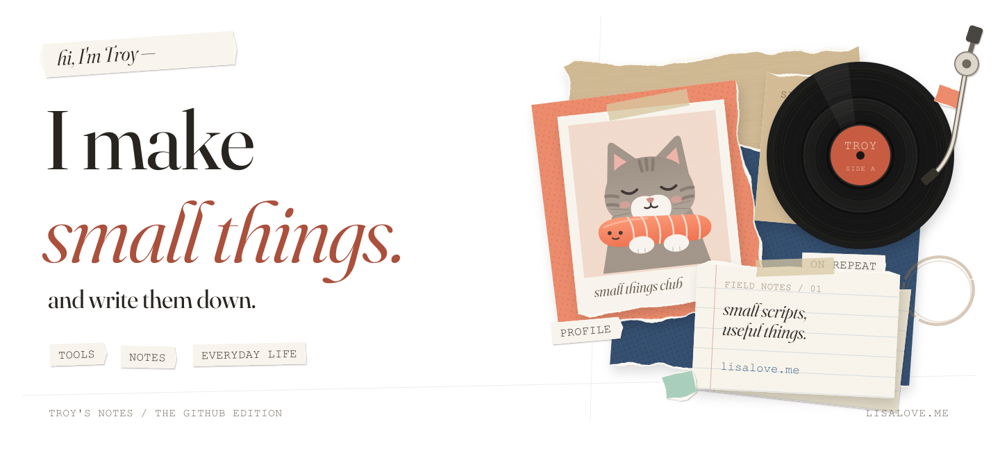
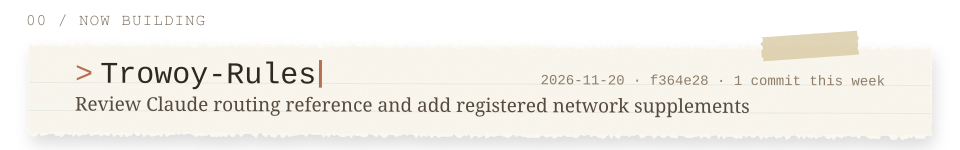
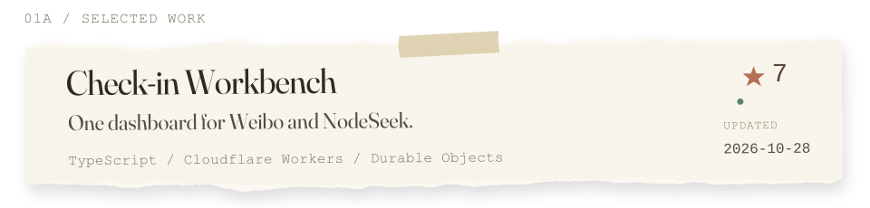
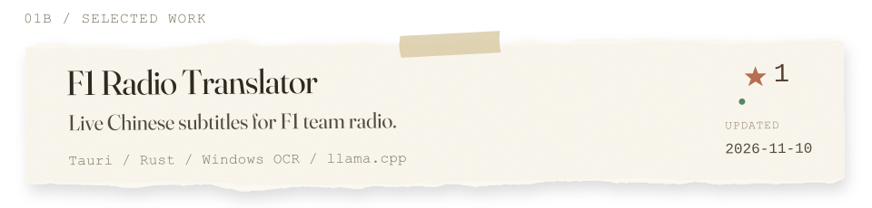
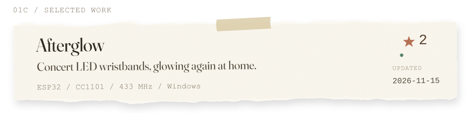
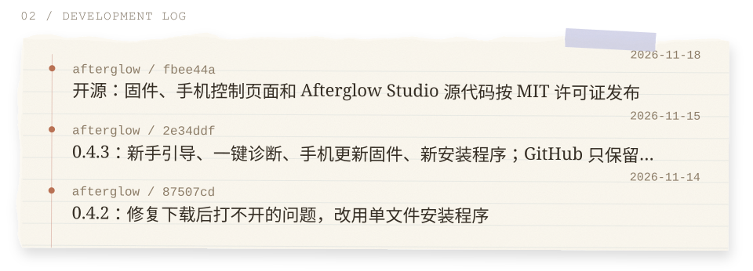
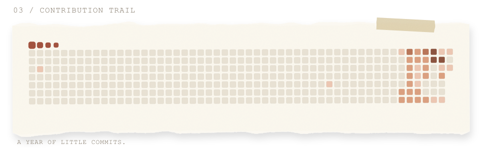
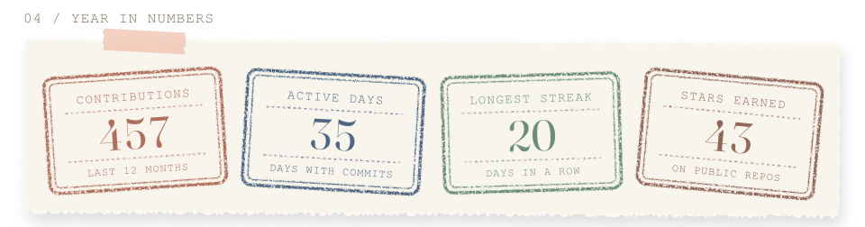

**English** | [简体中文](README.zh-CN.md)

<picture>
  <source media="(prefers-color-scheme: dark)" srcset="./assets/collage-header-dark-transparent.svg">
  <source media="(prefers-color-scheme: light)" srcset="./assets/collage-header-light-transparent.svg">
  
</picture>

  <a href="https://github.com/Trovoy?tab=repositories"><code>REPOSITORIES</code></a> &nbsp; / &nbsp;
  <a href="https://github.com/Trovoy?tab=overview"><code>ACTIVITY</code></a> &nbsp; / &nbsp;
  <a href="https://lisalove.me"><code>BLOG</code></a>

<a href="https://github.com/Trovoy/afterglow">
<picture>
  <source media="(max-width: 600px) and (prefers-color-scheme: dark)" srcset="./assets/now-mobile-dark-transparent.svg">
  <source media="(max-width: 600px)" srcset="./assets/now-mobile-light-transparent.svg">
  <source media="(prefers-color-scheme: dark)" srcset="./assets/now-dark-transparent.svg">
  <source media="(prefers-color-scheme: light)" srcset="./assets/now-light-transparent.svg">
  
</picture>
</a>

<a href="https://github.com/Trovoy/Weibo_Checkin">
<picture>
  <source media="(max-width: 600px) and (prefers-color-scheme: dark)" srcset="./assets/weibo-en-mobile-dark-transparent.svg">
  <source media="(max-width: 600px)" srcset="./assets/weibo-en-mobile-light-transparent.svg">
  <source media="(prefers-color-scheme: dark)" srcset="./assets/weibo-en-dark-transparent.svg">
  <source media="(prefers-color-scheme: light)" srcset="./assets/weibo-en-light-transparent.svg">
  
</picture>
</a>

<a href="https://github.com/Trovoy/f1-radio-translator">
<picture>
  <source media="(max-width: 600px) and (prefers-color-scheme: dark)" srcset="./assets/f1-en-mobile-dark-transparent.svg">
  <source media="(max-width: 600px)" srcset="./assets/f1-en-mobile-light-transparent.svg">
  <source media="(prefers-color-scheme: dark)" srcset="./assets/f1-en-dark-transparent.svg">
  <source media="(prefers-color-scheme: light)" srcset="./assets/f1-en-light-transparent.svg">
  
</picture>
</a>

<a href="https://github.com/Trovoy/afterglow">
<picture>
  <source media="(max-width: 600px) and (prefers-color-scheme: dark)" srcset="./assets/afterglow-en-mobile-dark-transparent.svg">
  <source media="(max-width: 600px)" srcset="./assets/afterglow-en-mobile-light-transparent.svg">
  <source media="(prefers-color-scheme: dark)" srcset="./assets/afterglow-en-dark-transparent.svg">
  <source media="(prefers-color-scheme: light)" srcset="./assets/afterglow-en-light-transparent.svg">
  
</picture>
</a>

<a href="https://github.com/Trovoy?tab=overview">
<picture>
  <source media="(max-width: 600px) and (prefers-color-scheme: dark)" srcset="./assets/activity-mobile-dark-transparent.svg">
  <source media="(max-width: 600px)" srcset="./assets/activity-mobile-light-transparent.svg">
  <source media="(prefers-color-scheme: dark)" srcset="./assets/activity-dark-transparent.svg">
  <source media="(prefers-color-scheme: light)" srcset="./assets/activity-light-transparent.svg">
  
</picture>
</a>

<picture>
  <source media="(prefers-color-scheme: dark)" srcset="./assets/contribution-trail-dark-transparent.svg">
  <source media="(prefers-color-scheme: light)" srcset="./assets/contribution-trail-light-transparent.svg">
  
</picture>

<picture>
  <source media="(max-width: 600px) and (prefers-color-scheme: dark)" srcset="./assets/numbers-mobile-dark-transparent.svg">
  <source media="(max-width: 600px)" srcset="./assets/numbers-mobile-light-transparent.svg">
  <source media="(prefers-color-scheme: dark)" srcset="./assets/numbers-dark-transparent.svg">
  <source media="(prefers-color-scheme: light)" srcset="./assets/numbers-light-transparent.svg">
  
</picture>

Building small tools.

